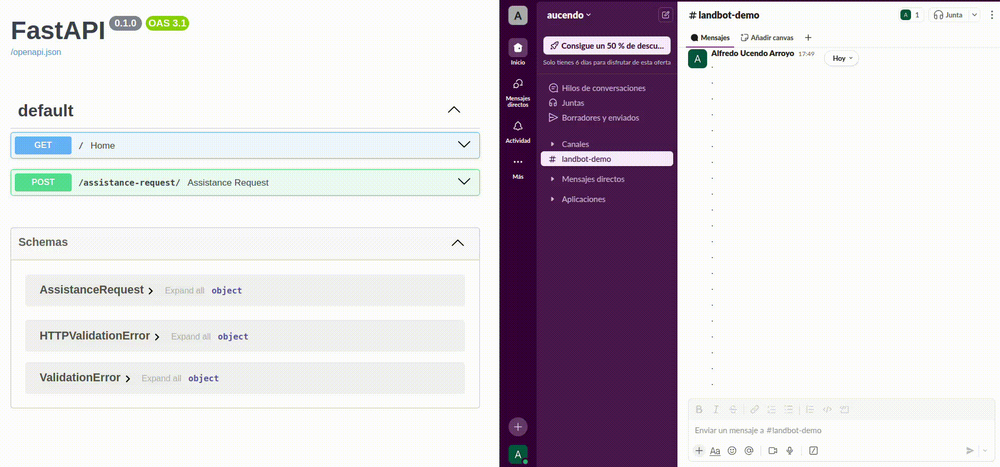

Solution to backend challenge described in [CHALLENGE.md](CHALLENGE.md).
Below are the instructions to run the server and development notes about the implementation and further improvements that could be done.

## Requirements

- Docker
- Docker Compose

Setup a `.env` file with the following content:

```bash
SLACK_WEBHOOK_URL=<your_slack_webhook_url>
```

> [!IMPORTANT]
> Slack integration is the only implemented channel and requires a working hook.

## Usage

Once the the server is running, you can send a POST request to `/assistance-request` with the following payload:

```json
{
  "topic": "sales",
  "description": "I need help with my order"
}
```

> [!TIP]
> Use the Swagger UI interactive docs at [http://localhost:8000/docs](http://localhost:8000/docs) to test the endpoint.

## Start server

Starts the server in development mode on background.

```bash
make up
```

Then API is served at [http://localhost:8000](http://localhost:8000).

Interactive docs are available at [http://localhost:8000/docs](http://localhost:8000/docs)

## Stop server

```bash
make down
```

## Other commands

Open logs in streaming mode.

```bash
make logs
```

Run tests

```bash
make test
```

Run linter


```bash
make lint   # just check
make fix    # autofix
```

## Notes

### Approach

- Since channel selection is based on topic and just determines the logic/behavior, I've implemented a Strategy pattern to handle this using `ChannelRouter` class to select the right channel, which must be a concrete implementation of `Channel` (later renamed to `BaseChannel`).
- Added a working endpoint `POST /assistance-requests` with some basic integration tests (`tests/test_app.py`) that already covers the challenge functionality requirements.
- Now that it's working let's do some refactor so I can unit test each part without the need of the whole server running or perform actual requests to Slack.
  - **Note:** as Slack channel it's implemented a side effect of integration tests is it actually send messages to slack each time.
- Added `ChannelRouter` as dependency of the endpoint and mocked it in tests. Now `tests/test_app.py` is a unit test suite that doesn't perform any actual request to Slack. It just tests that endpoint uses the channel provided by the router. This makes the test faster and more flexible to small changes, we could add more topics and/or channels without having to modify the test.
  - **Note:** I removed all integration tests but might be interesting to keep them as well to be able to test the whole flow.
- Added unit tests for `ChannelRouter` in `tests/test_channel_router.py`.
- Now that we have everything working with a good test coverage, let's reorganize folders and files (including renaming) to make it more readable and maintainable. Since this is a very small project, I would rule out using DDD or hexagonal architectures because they might be too complex, although they can be a good option to iterate on as the project scales. For the exercise, I think a ***screaming architecture*** approach is more appropriate.


Changed project structure from

```
.
├── app
│   ├── api
│   │   └── routes.py
│   ├── config.py
│   ├── logger.py
│   ├── main.py
│   ├── models.py
│   └── services
│       ├── channel.py
│       ├── channel_router.py
│       ├── email.py
│       └── slack.py
├── CHALLENGE.md
├── docker-compose.yml
├── Dockerfile
├── Makefile
├── README.md
├── requirements.txt
└── tests
    ├── test_app.py
    └── test_channel_router.py

```

to

```
.
├── app
│   ├── assistance_request
│   │   ├── api_routes.py
│   │   ├── channels
│   │   │   ├── base_channel.py
│   │   │   ├── channel_router.py
│   │   │   ├── email.py
│   │   │   └── slack.py
│   │   └── models.py
│   ├── core
│   │   ├── logger.py
│   │   └── settings.py
│   └── main.py
├── CHALLENGE.md
├── docker-compose.yml
├── Dockerfile
├── Makefile
├── README.md
├── requirements.txt
└── tests
    ├── test_app.py
    └── test_channel_router.py

```
- Finally, checked tests and linter and made sure everything is working as expected.

Here is a recorded demo using the slack channel integration:



### Further improvements and thoughts

Although it fulfills the basic functionality required, there is plenty of room for improvement. This is a list of tasks I would have considered completing if I had spent more time on it or suggestions to scale the project:

- **Improve generic input data validation**. Add to `AssistanceRequest` pydantic model restrictions about min length for description (currently accepts empty string) and change "topic" to an Enum of allowed values. Also add these edge cases to the tests.
- **Add specific channel validation, formatting and sanitization**. Ensure description is valid **and secure** for its destination channel. For example, Slack has a length limit per message and admits actions like mention people. Maybe we want to allow only plain text. Email has a different set of restrictions.
- **Setup production build**. Setup a production build with a more secure and optimized configuration. I could use docker multi-stage build to reduce image size and improve security. Currently, the image is built with the development dependencies and hotreload.
- **Restore integration tests**. Add integration tests that actually send messages to Slack. This is important to ensure the whole flow is working as expected. They could be run in a separate pipeline or in a different environment on demmand to avoid spamming the channel.
- **Improve observability**. Add logging and monitoring to the application. I've added a simple logger but it could be improved to log more information and errors. I could use tools like Sentry, Prometheus and Grafana for this.
- **Implement a retry mechanism**. If the message fails to be sent to the channel, we could retry a few times before giving up. This could be done with a simple decorator or a more complex library like Tenacity.
- **Make channel integrations more generic and reusable**. Currently slack channel uses a webhook url defined by an environment variable. This make the app capable of sending messages to only one slack channel. We could make this more generic and pass the webhook url in the constructor so we could send messages to different slack channels. This could be useful to send messages to different teams or to different channels based on the topic. Similar changes could be done to the email channel and the target email address.
- **Add support for dynamic topics and channels**. Currently, the channel is selected based on the topic. We could add a way to dynamically add new channels and topics without changing the code. This could be done with a database.
  - For example, we could have a table in the database with the following columns: `topic`, `channel`, `channel_config`. The `channel_config` could be a JSON field with the configuration for the channel (like the webhook URL for Slack) and support different Slack webhooks.
- **Add support for multiple channels**. Currently, the router selects only one channel. We could change this to allow multiple channels to receive the message. This could be useful for redundancy or to send the message to different teams. If it scales up it could make sense to implement a event driven architecture with a message broker like RabbitMQ. Where each assistance request is dispatched as an event and subscribers are the channels instances responsible for sending the message to its destination. This adds more complexity but makes the system more scalable and flexible and allows asynchronous processing.
- **Add security measures**. Currently, the app is very simple and doesn't have any security measures. We could add some basic security measures like rate limiting, authentication and authorization. We could use jwt tokens or api keys.

## How to add and use a new channel or topic?

To add a new channel add a new class in `app/assistance_request/channels` (i.g: `sms.py`) that inherits from `BaseChannel` and implements the `send` method.

To use the new channel go to method `get_channel_router` in `app/assistance_request/api_routes.py` where `ChannelRouter` is instantiated and add the new case or modify an existing one.

Let's say we just created a new `SMSChannel` and want to link it to a new topic `support`. We would do the following modification:

```python
from app.assistance_request.channels.sms import SMSChannel

def get_channel_router():
    return ChannelRouter({
        ... # existing cases
        "support": SMSChannel()
        })
```
